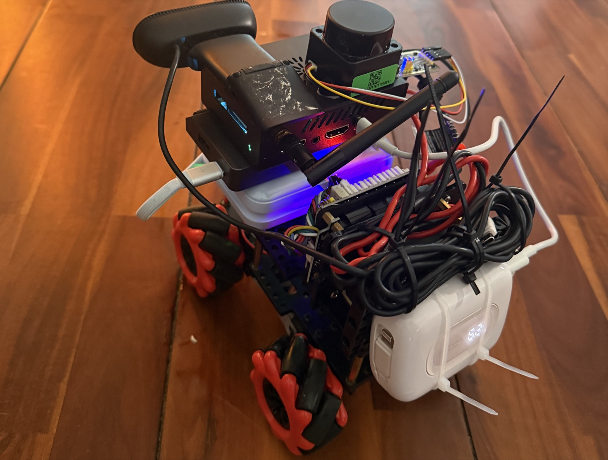
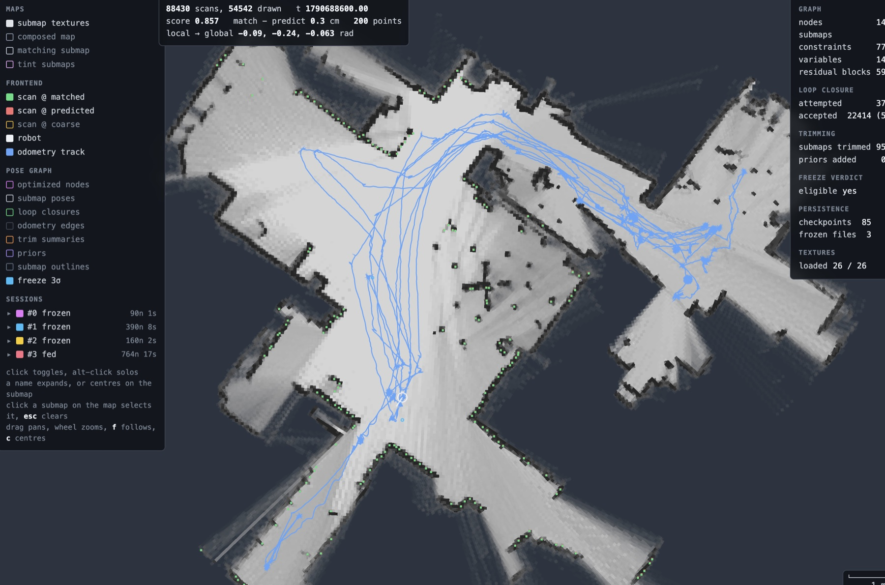
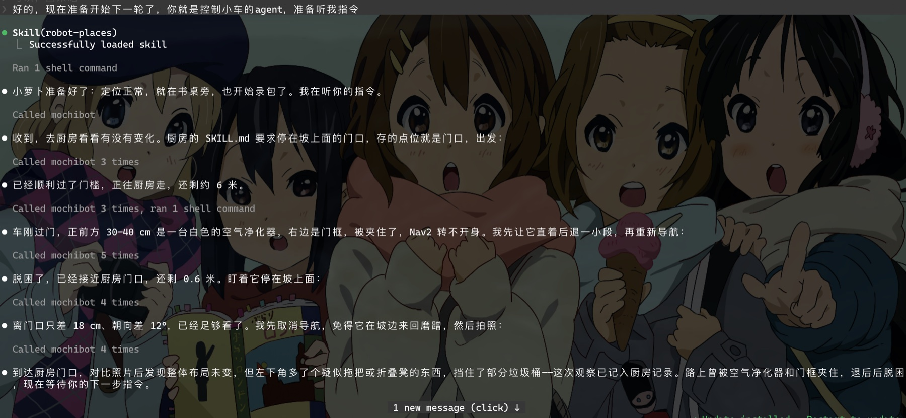

# EvergreenSLAM

常驻的 2D 激光 SLAM，带命名地点，作为 LLM agent 的空间记忆。

[English](../README.md) | 中文

---

## Hello, world

```
$ egs here
current places/dock 0.4m
closest places/dock 0.4m frozen; places/kitchen 5.0m frozen
robot 1.90,-0.50,0.07  keyframe 1s  @solve 418
match 0.74 (avg 0.72)
```

会用工具的 agent 已经能写代码、操作电脑，在实体机器人上的应用则还不成熟。不论用的是哪个
模型，这样的 agent 都需要空间记忆。它得能通过一句命令、
一段文字或一张图片记住一个地点，之后让机器人回到那里，而且这份记忆要经得住上下文压缩、地图
重新优化和进程重启。EvergreenSLAM 是围绕这个需求设计的 2D 激光 SLAM。它作为后台进程常驻在
机器人上，不区分建图和定位模式：一直往当前 *session* 里建图，同时对着已经*冻结*的 session 定位；
一个 session 建出足够多的新区域、位姿约束足够好之后，自己冻结。地点是*锚点*，绑在位姿图的子图上
而不是坐标上，以一棵目录树加一个小 CLI（`egs`）的形式暴露给 agent。扫描匹配和子图沿用
Cartographer；上面的 lifelong 这一层是本项目自己的：session 与冻结，带边缘化和 Chow-Liu
稀疏化的删减，冻结位姿在优化器里设为常量，使内存和 CPU 受建图面积约束而不受运行时长约束。
系统在一颗 215 元的雷达和一块 RK3588 板子上跑过，也在公开的 2D 数据集上跑过。

<p align="center">
  
  <br>
  <sub>测试平台：一颗 2D 雷达（215 元，约 30 美元），一块 RK3588 的 Orange Pi，麦轮，充电宝。</sub>
</p>

## 动机

**agent 没有空间记忆。** agent 的记忆是文本，只能活到上下文结束；写成坐标的位置，地图一优化、
进程一重启就过期了。agent 能用的是一个*名字*，它始终解析到同一个物理位置，外加一个把在那里看到
的东西记下来的办法。

**无人值守的 SLAM。** 常见的 SLAM 流程是：开着车建图，存图，切到定位模式，环境变了调参，
变多了重建。每一步都要人操作。给 agent 用的空间记忆必须是一个后台服务，这些步骤一个都不能有。

**成本。** 这份记忆得便宜到可以在小车上一直开着。3D 激光几百美元起步，还得配一块跟得上它数据量
的板子。摄像头便宜，但稠密的或基于学习的视觉 SLAM 通常要的算力比一块小板子多，而且摄像头在黑暗、
无纹理的墙面和光照变化下会退化。2D 激光两百块钱左右，不需要 GPU，不受光照影响；它自己的失效场景
（玻璃、镜子、强阳光）本文不处理。出于同样的理由，管线不融合 IMU、轮式里程计和摄像头：每多一种
传感器就多一套标定、时间同步、驱动和按车调参。代价是运动预测只能靠激光自己，一个 Singer 运动
模型的卡尔曼滤波，只吃扫描匹配的结果，快速转弯和长而没特征的路段预计会吃力。这里的立场是：
便宜的几何，加上挂在命名地点上的稀疏语义（比如让视觉语言模型偶尔写一句"垃圾桶在这"），
在这个场景下比稠密视觉 SLAM 更划算。

## 它怎么工作

### session 与冻结

建图以 session 组织。前端一直往当前 session 里建图；后端对可达范围内所有完成的子图做回环，不管
冻没冻结，包括当前 session 自己的，而下面的滚动窗口让这些子图保持是最近的。环境渐变时，机器人匹配的是此刻的世界，而这些最近的子图又被约束到冻结的
底图上。

第一个 session 有了完成的子图就成为冻结的底图。之后的 session 要先在冻结区域之外建出足够多的
新区域、并且不再增长，才会被判断；和某个冻结 session 连上、且每张完成子图位姿的边缘标准差逐轴
低于阈值时冻结。冻结让该 session 的文件只读、位姿在之后所有优化里保持常量。只在已知区域里转的
session 不会自动冻结（`egs session freeze --yes` 可以手动冻）；任何没冻结的 session 连续五次以上
启动都没再喂数据就被丢掉（可配置）。
session 之间重叠的地方，合成地图取更有把握的那个格子。因此，已有区域里的变化在当前 session
活着的时候能看到，但不会被冻进去；变了的房间重新冻结在计划里，尚未实现。

<p align="center">
  
  <br>
  <sub>一次长时间运行中的浏览器调试视图：四个 session，三个已冻结。</sub>
</p>

### 有界增长

两个机制让图不随运行时长增长。

*带稀疏化的删减。* 活着的 session 在重走的地方只保留自己子图的一个滚动窗口：被更新的子图盖住了
面积、或者更新的几趟盖住了轨迹的旧子图会被删掉。删除是边缘化，不是直接丢：取被删节点的 Markov
毯，算幸存者的联合协方差，再把得到的稠密信息稀疏化成一棵 Chow-Liu 树（两两互信息上的最大生成
树），用树的边替换被删的约束；跨得太远的边转成按边缘协方差加权的先验。冻结时，大部分已经落在
冻结地图里的完成子图也这样处理，全都落在里面就留一张。

*冻结的 session 是常量。* 冻结位姿在 Ceres 问题里是设为常量的参数块，两张冻结子图之间不建约束，
冻结的子图从不修改。优化的规模因此只随活着的 session 走，不随整张地图走；冻结部分随建图面积线性
增长。模拟 30 圈的运行是有界的，车上长时间跑的还没量过。

### 地点即锚点

存下的地点是一个锚点：位姿图的一张子图加一个相对变换。图重新优化，地点跟着子图动；重启之后
名字照样解析。锚点经得住回环、删减、冻结、重启和写到一半被打断，`egs where` 解析的就是它。

### 记忆即目录

`memory/places/kitchen/table/apple` 是地点里的一个东西。agent 用 `ls`、`cat`、`mv`、`grep` 操作
这棵树。只有活进程独有的东西，比如位姿、存点位、地图和 session 管理，才走 `egs`。禁区、笔记和
按地点的 skill 都在同一棵树里。`egs view here` 把当前扫描叠在机器人周围的地图上画出来，agent
自己看定位有没有漂。

### 实现

纯 2D，全部 `double`，位姿用 `Eigen::Affine2d`。激光里程计用相关性匹配加 Ceres 精修，子图是
概率栅格，位姿图用分支定界回环加 Ceres 优化，再往上是按 session 的删减、冻结和原子提交的持久化。
`core/` 不依赖 ROS，ROS 2 只是一个适配器。

## 一次实跑

2026-09-29，Claude Code 开着上面的平台在一套住宅里跑了一趟。agent 手里有一个封装了 `egs` 和
Nav2 导航的小工具（`mochibot`），还有一个在本仓库 `evergreenslam` skill 之上按这套房子写的
skill（`robot-places`）。对话是中文的，各步及其背后的 `egs` 调用如下：

1. **"你就是控制小车的 agent，准备听我指令。"** 它加载 skill，跑 `egs here`，报告：定位正常，
   在书桌旁，开始录包。
2. **"去厨房看看有没有变化。"** 它读记忆目录里厨房的 `SKILL.md`，上面写着停在坡上面的门口。
   存的点位就是门口，`egs where places/kitchen/door` 给出接近位姿，它交给导航。
3. 过了门槛，还剩约 6 米。
4. 刚过门就被夹住：正前方 30 到 40 cm 是空气净化器，右边是门框，Nav2 转不开身。它让车直着
   后退一小段，重新规划。
5. 脱困，离门口 0.6 米。盯着车停在坡上。
6. 离存的位姿差 18 cm、12°。它判断够了，在车开始在坡边来回磨蹭之前取消导航，拍照。
7. 跟上次记录的照片对比：布局没变，但左下角多了个东西，疑似拖把或折叠凳，挡住了部分垃圾桶。
   用 `egs observe` 写进厨房的记录，然后等指令。

<p align="center">
  
</p>

开车、后退、拍照和对比属于那个封装工具和 Nav2，`egs` 只回答东西在哪、负责记录。用户没有输入
过任何坐标，位姿是从 `egs` 传给导航的。

跑完之后让同一个 agent（Claude Code，Opus 5.5 模型）简单评价到那时为止的使用体验，覆盖不止
这一趟，也早于 v0.2 的功能。概括起来：它在这个平台上从空地图开始，存下厨房和书桌，之后按名字
回去看变化，重启后地图和位姿无需干预就恢复了；几乎全程只是 `egs` 命令和一个普通目录，没有碰过
坐标，也没有碰过 ROS 的细节。

## 验证与局限

这是一个 preview，不是产品。范围限定在核心，已知的缺项列在下面。

在 macOS 和 Linux 上测过：单测；前端、扫描匹配器和后端每一级（回环、删减、冻结、持久化、重定位、
锚点）的模拟激光端到端测试；手动对后端测试跑 ThreadSanitizer。还没有 CI。在上面的平台和公开
数据包上跑过：激光里程计、回环、多 session 建图与自动冻结和删减、原子提交的持久化和命名地图、
agent 服务和 `egs`、浏览器调试视图、rviz2 插件。数据集上回放工具会报告相对参考轨迹的误差
（见 ROS README）；这里还没有整理成结果表。

- 不融合 IMU、轮式里程计和摄像头，没有 3D（见「动机」）。
- 冻结的 session 不能解冻，变了的房间也不会自动刷新（见「session 与冻结」）。冻结地图错了就换一个地图目录。
- 没有动态障碍物滤除。里程计对几何退化（长走廊、大空房）没有办法；回环会拒掉走廊里有歧义
  的匹配。
- 一台机器人一张图。不支持多机。
- 机器人被搬走了要告诉它：`egs init-pose` 或 `egs relocalize`。没有自动的绑架检测。
- 冻结阈值还没对着参考轨迹标定过。
- 一个已知的里程计缺陷：模拟房间里从静止沿着与墙平行的轴直线跑，观察到过一直停在原点。
  对应的回归测试先禁用着，等查清原因。
- agent 层 v0.2 的全部（导出为 Nav2 keep-out filter 掩码的禁区、在线删除正在建图的 session、
  `--json` 输出、`observe --attach`、`place save --offset`、`egs here` 里的匹配分、`/odom` 的
  twist）过了测试，还没上车跑过；禁区在 Nav2 那一侧也还没对着真实 Nav2 验证
  （KeepoutFilter 的配置在 ROS README 里）。

只在一套住宅和公开数据集上评估过。欢迎开 issue。

## 编译与运行

只编 core，不需要 ROS：

```bash
cmake -S core -B build -DEVERGREENSLAM_BUILD_TESTS=ON && cmake --build build -j8 && ctest --test-dir build
```

依赖：Eigen、Ceres、glog、yaml-cpp、protobuf（库和 `protoc`）、OpenMP、gtest。

```bash
# macOS
brew install eigen ceres-solver glog yaml-cpp protobuf libomp googletest
# Ubuntu 24.04（core 链接 yaml-cpp 0.8，22.04 的包太旧）
sudo apt install libeigen3-dev libceres-dev libgoogle-glog-dev libyaml-cpp-dev \
                 libprotobuf-dev protobuf-compiler libgtest-dev
```

或者让 [pixi](https://pixi.sh) 把一切装好，包括 ROS 2 Jazzy 和 rviz2（macOS Apple Silicon
和 Linux；`pixi.toml` 头部列出了全部任务）：

```bash
pixi run core-test                      # 只有 core
pixi run agent-test                     # agent 服务和 egs
pixi run -e ros ros-test                # ROS 2 适配器
SCAN_TOPIC=/base_scan BASE_FRAME=base_footprint pixi run -e ros bag bags/wg_cafe   # 回放，浏览器视图在 http://localhost:8642
pixi run -e ros live                    # 实时节点：/scan 进，地图、tf 和 agent 服务出
```

`live` 需要一个雷达驱动往 `/scan` 发 `sensor_msgs/LaserScan`（`SCAN_TOPIC` 可改），以及
`base_link` 到雷达坐标系的 TF（两者不同时）。它总会用激光里程计发 `/odom`（不带协方差），开着
`publish_tf` 时还发 odom 到 base_link 和 map 到 odom 两个 TF；底盘驱动如果也发 odom 到 base_link，
关底盘那边的，因为 `publish_tf=false` 会把 map 到 odom 一起关掉；两个 `/odom` 话题也要 remap
掉一个。配置从 `configs/evergreenslam.yaml` 起步，museum 和 carmen 是给 museum 和 CARMEN 数据集
用的。pixi 下地图存在 `runs/maps`（`MAP_ROOT` 可改；`bag` 只在设了 `MAP_ROOT` 时才落盘）。pixi
只配了 osx-arm64 和 linux-64；Linux ARM 板子上用系统包或 colcon。在 ROS 2 Jazzy 上测过。

仓库本身就是一个 colcon 工作空间源：放进任意 `ws/src`，然后
`rosdep install --from-paths src --ignore-src -y && colcon build`。Docker Compose 在 Linux 上
封装了同样的目标（`docker compose run --rm core-test`）。

### 数据

仓库不带数据。公开的 2D 激光包大多是 ROS 1 的，两个脚本不装 ROS 也能转：

```bash
pip install rosbags
curl -O http://download.ros.org/data/graph_slam/wg-cafe.bag
python3 tools/convert_ros1_bag.py wg-cafe.bag bags/wg_cafe
SCAN_TOPIC=/base_scan BASE_FRAME=base_footprint EXTRA="--speed 4" pixi run -e ros bag bags/wg_cafe
```

开着浏览器视图时回放按真实时间走，`EXTRA="--speed 4"` 加速。回放时 agent 服务只在设了
`MAP_ROOT` 且加 `EXTRA="--agent_port 8643"` 时才开。

经典数据集（Intel Research Lab、ACES、MIT Killian Court）是 CARMEN 日志，在
[Freiburg SLAM evaluation 页面](http://ais.informatik.uni-freiburg.de/slamevaluation/datasets.php)；
`tools/convert_carmen_log.py` 把 `.clf` 转成包。回放工具怎样对照参考轨迹打分，见
[`adapters/ros2/evergreenslam_ros/README.md`](../adapters/ros2/evergreenslam_ros/README.md)。

### agent 接口

实时节点跑起来后，agent 服务监听 `127.0.0.1:8643`，`egs` 是客户端：

```bash
export PATH="$PWD/adapters/agent/egs/bin:$PATH"
egs help agent                     # 规则和命令表，不到 30 行
egs here                           # 机器人在哪
egs status                         # 地图健康：冻结底图、对齐、回环
egs place save places/kitchen/door # 记住脚下这个位置
egs where places/kitchen/door      # 位姿、精度，以及接近它的位姿
egs view here                      # 扫描叠在地图上，机器人周围
```

`egs` 是 Python 3.9+，不依赖任何第三方库。给 agent 装 skill：把 `adapters/agent/skills/evergreenslam/`
拷到它的 skills 目录；skill 的第一节就是上手步骤（`cd "$(egs root)"`，读 `memory/README.md`，
读到该地点为止的 `SKILL.md` 链）。服务只绑 `127.0.0.1`；agent 在另一台机器上时，改节点的
`agent_bind` 参数（走 `ros2 run`，pixi 任务没留口子）或者把端口隧道过去，再把 `EGS_URL` 指过去。
HTTP 契约见 [`adapters/agent/API.md`](../adapters/agent/API.md)，skill 是
[`adapters/agent/skills/evergreenslam/SKILL.md`](../adapters/agent/skills/evergreenslam/SKILL.md)。

### 目录

```
core/            SLAM 本体，无 ROS：sensor / mapping / lifelong（位姿图、session、持久化）/ utils
adapters/ros2/   三个 ament 包：msgs、节点与回放工具、rviz2 插件
adapters/agent/  agent 服务（HTTP）、egs CLI 和 agent skill
apps/webui/      浏览器调试视图
configs/         yaml 配置；configs/reference.yaml 列出全部键
tools/           包转换脚本和 TSan 门禁
```

## 相关工作与致谢

- [Cartographer](https://github.com/cartographer-project/cartographer)（Hess 等，2016；
  Apache 2.0）。相关性扫描匹配器、预计算栅格、概率栅格子图、体素和运动滤波、约束构建器沿用它
  的设计，rviz2 的子图显示移植自 `cartographer_rviz`。见 `NOTICE`。
  `core/src/utils/scan_matching` 离原版最近。Cartographer 没有 session、冻结和做边缘化的删减，
  这些是本项目的。
- 删减里的边缘化和 Chow-Liu 稀疏化沿用位姿图压缩这一支文献，思路同 Kretzschmar 与
  Stachniss（2012）。
- [Claude Code](https://claude.com/claude-code)。大部分代码是用 Claude 写的，设计、审查和测试
  由作者完成。
- [cpp-httplib](https://github.com/yhirose/cpp-httplib)（MIT）和
  [stb_image_write](https://github.com/nothings/stb)（公有领域），放在 `third_party/`。
- [RoboStack](https://robostack.github.io/)，它把 ROS 2 装进了 pixi，macOS 上的工作流全靠它。
- Freiburg 和 Willow Garage 的数据集，回放和打分用的是它们。

## 许可

Apache License 2.0，见 [`LICENSE`](../LICENSE) 和 [`NOTICE`](../NOTICE)。
